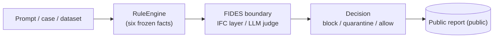

# Architecture

This directory documents the architecture of **CanaryWeave FIDES** — the
indirect prompt-injection detection harness for MCP-mediated agents. The docs are
written against the codebase as it stands after [ADR 0003](../adr/0003-collapse-to-facts-and-cases.md)
(the collapse to frozen facts and `.cases`), and they call out the places where
the code and the intended design have not yet converged (see [Known gaps](#known-gaps)).

## Start here

CanaryWeave evaluates whether a guard **stack** correctly blocks an indirect
prompt-injection **attack** while letting benign traffic through. Two evaluation
paths share one deterministic decision core (the `RuleEngine`):

- **Path A — `query_llm` gate**: preflight rules → quarantined model stub →
  postflight rules → deterministic IFC. Returns a `QueryResult`.
- **Path B — stack gate**: four guard stacks (`no_guard`, `regex_baseline`,
  `yara_rules`, `rules_plus_fides`) over `NormalizedFacts`. Returns a
  `GateDecision`. This path drives the benchmark.

## Documents

| Document | Read this when you want to… |
|---|---|
| [High-Level Design (`hld.md`)](hld.md) | Understand the system context, the components, the two evaluation paths, and the guard stacks. Start here. |
| [Low-Level Design (`lld.md`)](lld.md) | Work in the code: module map, dataclasses, the rule-engine algorithm, fact computation, FIDES modes, adapters, CLI. Includes the [terminology map](lld.md#terminology-map). |
| [Data Flow Diagrams (`dfd.md`)](dfd.md) | Trace how data moves: the two paths, rule evaluation, FIDES routing, `.cases` and dataset flows, and the public/private data contract. |

## Conventions

- **Diagrams are [Mermaid](https://mermaid.js.org/)** so they render natively on
  GitHub. Node labels that contain punctuation are quoted (`["…"]`).
- **Public vs private.** Diagrams tag data stores `(public)` or `(private)`. Raw
  attack payloads are private and are hashed into opaque identifiers before
  anything is published; only `(public)` stores are safe to release.
- **Terminology** follows [`CONTEXT.md`](../../CONTEXT.md). Where a code symbol
  differs from the glossary term (for example `TraceEvent` vs *NormalizedTrace*),
  the [LLD terminology map](lld.md#terminology-map) reconciles them. These docs do
  not rename code — they document the mapping.

## Known gaps

The refactor left a few documented seams between intent and current code. They are
listed here as the single source of truth and cross-referenced from the HLD and
DFD:

| Gap | Where | Detail |
|---|---|---|
| Deterministic IFC not wired into `rules_plus_fides` | [HLD §8](hld.md#8-known-post-refactor-gaps), [DFD §7](dfd.md#7-known-gaps-data-view) | ADR 0003 intends `FidesIFCLayer` stays always-on inside the stack; today only the `FidesJudge` runs there. The IFC layer is exercised only in Path A and the legacy smoke summary. |
| Divergent stack vocabulary | [DFD §7](dfd.md#7-known-gaps-data-view) | Legacy `metrics.summarize_smoke` uses `regex_guard / structured_rule_guard / rules_plus_fides_ifc`; the modern report uses canonical `StackName`. |
| Two fact representations | [LLD §2](lld.md#2-core-data-structures) | `facts.NormalizedFacts` (Path B input) vs `models.EvaluationRecord` (rule input), bridged by `_facts_to_trace_and_policy`. |
| `TraceEvent` synthetic, not yet MCP-wire | [LLD §2.1](lld.md#21-the-flat-record-and-its-source-trace) | Facts are derived from a framework-built trace; the MCP wire integration is future work at the `build_evaluation_record` seam. |

## Related reading

- [`CONTEXT.md`](../../CONTEXT.md) — the canonical glossary.
- [`docs/adr/`](../adr/) — architecture decision records; [ADR 0003](../adr/0003-collapse-to-facts-and-cases.md) is the refactor these docs describe.
- [`design/`](../../design/) — deeper design notes and the authoritative `.war` rule schema.
- [`docs/rule_authoring.md`](../rule_authoring.md) — how to write rules.
