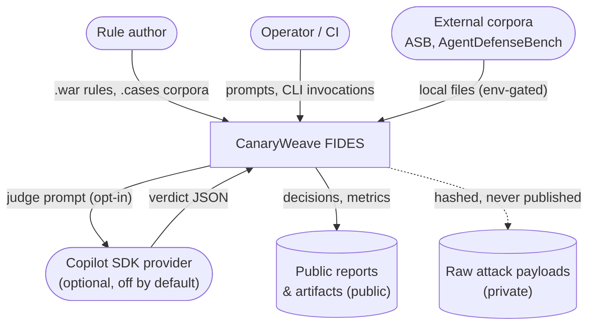
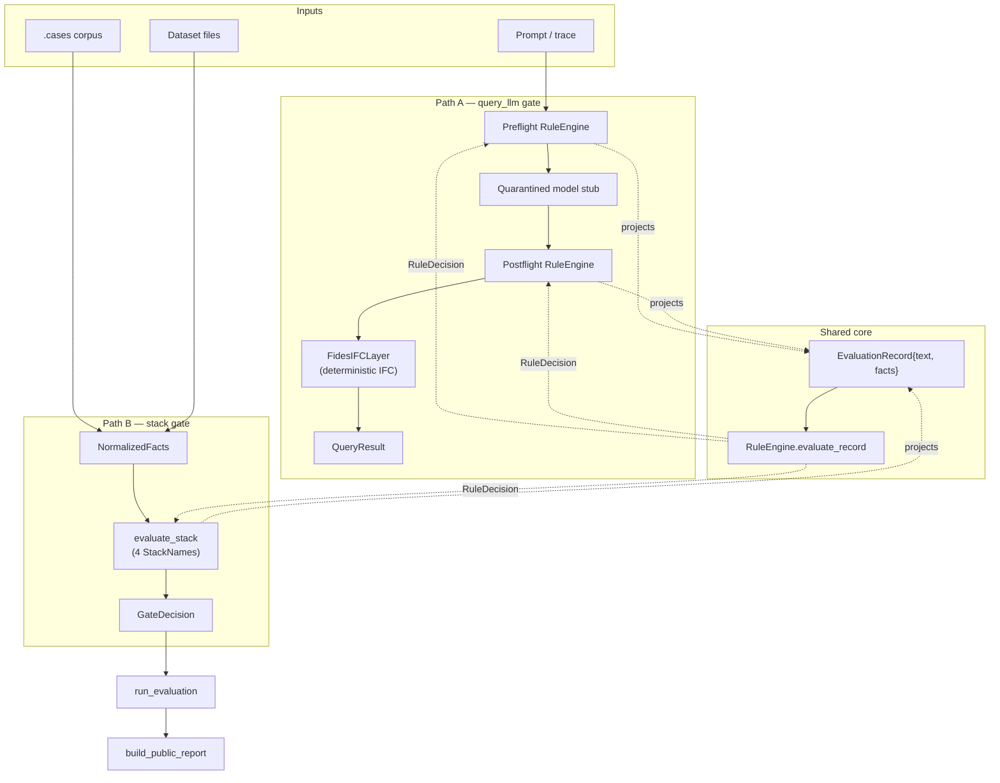
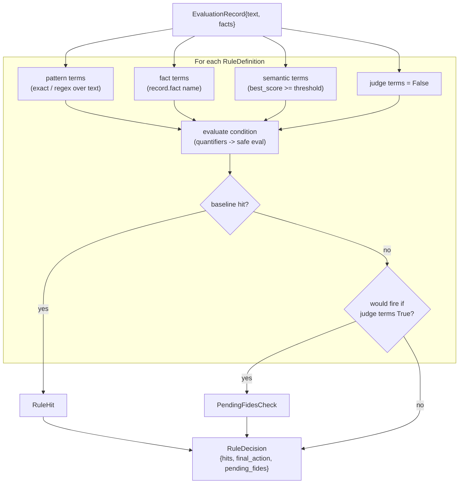
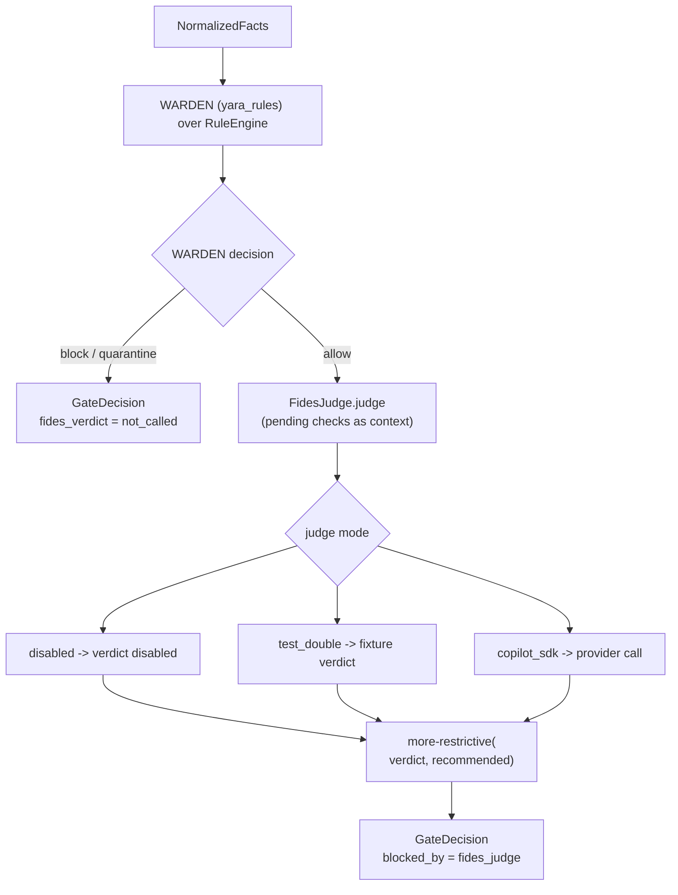
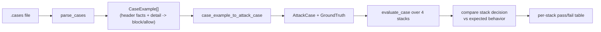
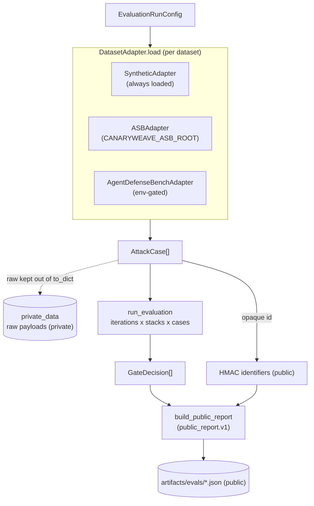

# Data Flow Diagrams (DFD)

> **Scope.** How data moves through CanaryWeave FIDES, from external input to
> decision and report. Read the [HLD](hld.md) for the component picture and the
> [LLD](lld.md) for the data structures named below. Terms follow
> [`CONTEXT.md`](../../CONTEXT.md).
>
> **Legend.** Rectangles are processes, cylinders are data stores, rounded nodes
> are external entities. A store tagged **(private)** never leaves the process
> boundary in cleartext; a store tagged **(public)** is safe to publish. The
> public/private split is the framework's core data-handling contract.

## 1. Level 0 — context

The framework runs fully offline by default. The provider edge is dashed-in only
when `--fides-mode copilot_sdk --provider-calls-enabled --model …` are all set.

## 2. Level 1 — the two evaluation paths

Both paths project their normalized window to the same `EvaluationRecord` and run
the same `RuleEngine`; they differ only in what wraps the core and what result
envelope they return (`QueryResult` vs `GateDecision`).

## 3. Level 2 — rule evaluation (the shared core)

`final_action` is the most-restrictive action over all hits (block ▸ quarantine ▸
allow). `pending_fides` carries the rule questions that only a judge can resolve —
the seam Path B uses next.

## 4. Level 2 — FIDES routing inside `rules_plus_fides`

> **Note the routing.** When WARDEN already blocks or quarantines, the judge is
> short-circuited (`not_called`). The judge is consulted only on the WARDEN-allow
> branch. The deterministic `FidesIFCLayer` is **not** in this flow — see
> [§7](#7-known-gaps-data-view).

## 5. Level 2 — `.cases` corpus flow (`warden test`)

The oracle is the **stack outcome** (block/allow), not a specific rule id — a case
passes when the stack's decision matches the expected behavior.

## 6. Level 2 — dataset evaluation flow (`eval`)

Adapters hash raw material into opaque identifiers (override key via
`CANARYWEAVE_PUBLIC_HMAC_KEY`) and keep raw payloads in `private_data`, which is
excluded from every `to_dict`. Missing env-gated datasets resolve to a
`skipped_missing_local_path` result rather than an error.

## 7. Known gaps (data view)

These are data-flow consequences of the ADR 0003 refactor, surfaced for honesty
(cross-referenced from the [HLD gap table](hld.md#8-known-post-refactor-gaps)):

| # | Gap | Data-flow impact |
|---|---|---|
| 1 | `FidesIFCLayer` absent from `rules_plus_fides` | The deterministic IFC checks (trusted_action, permitted_flow) never run in Path B. ADR 0003 intends IFC stays always-on; only the LLM judge runs today. |
| 2 | Divergent stack vocabulary | `metrics.summarize_smoke` emits `regex_guard / structured_rule_guard / rules_plus_fides_ifc`; `build_public_report` emits canonical `StackName`. A consumer joining the two reports must map names by hand. |
| 3 | Two fact representations | `facts.NormalizedFacts` (Path B input) and `models.EvaluationRecord` (rule input) both describe "the facts", bridged by `_facts_to_trace_and_policy`. A reader tracing data must cross the bridge to follow a value. |
| 4 | `TraceEvent` is synthetic today | Every fact is derived from a framework-built `TraceEvent`, not yet from the MCP wire. The projection seam (`build_evaluation_record`) is where real MCP data will later enter. |

## Related documents

- [High-Level Design](hld.md) · [Low-Level Design](lld.md)
- [ADR 0003](../adr/0003-collapse-to-facts-and-cases.md) — the refactor of record.
- [`automation/mitre/README.md`](../../automation/mitre/README.md) — the MITRE
  enrichment data flow (separate offline pipeline).
