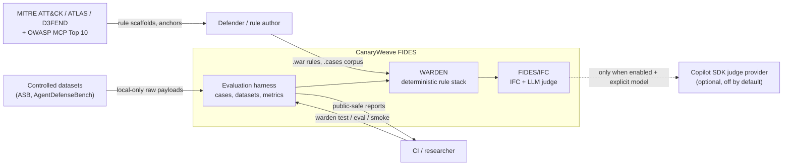
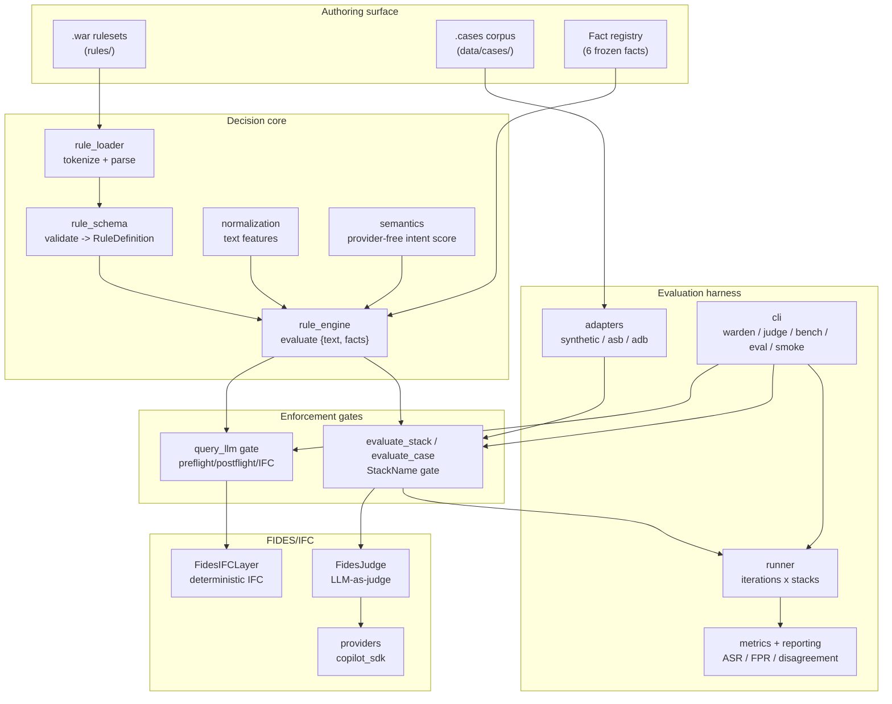
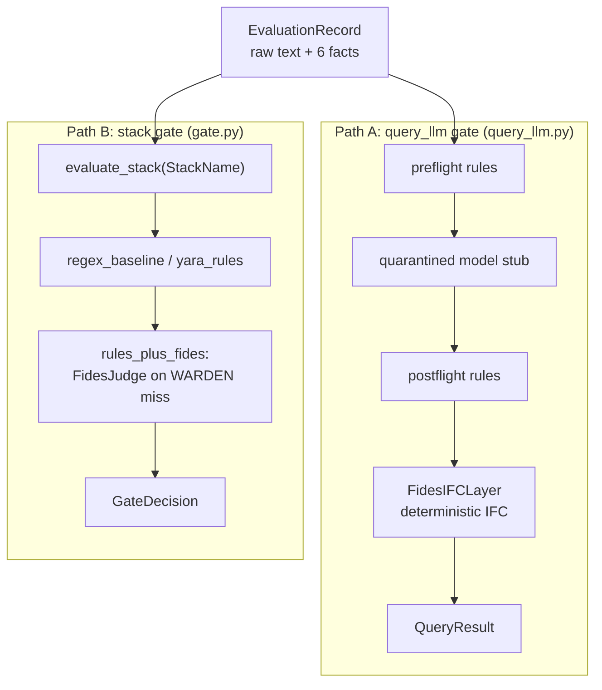

# High-Level Design (HLD)

> **Scope.** This document describes CanaryWeave FIDES at the component level: what
> the major parts are, how they fit together, and the two evaluation paths they
> compose. For module- and class-level detail see the [Low-Level Design](lld.md);
> for data movement see the [Data Flow Diagrams](dfd.md). Domain terms are defined
> once in the root [`CONTEXT.md`](../../CONTEXT.md) glossary and are not redefined here.

## 1. Purpose

CanaryWeave FIDES is a **controlled research POC** that compares four guard stacks
around quarantined `query_llm` calls, to test one narrow claim:

> A human-reviewable structured rule layer (WARDEN) improves over plain regex
> pattern matching because it evaluates policy-relevant context, not only text
> substrings; an optional FIDES/IFC layer can then reduce remaining
> policy-relevant attack-success-rate by reasoning about information flow.

The design mirrors the OPA/Rego philosophy: **decouple policy decision from
enforcement**. The policy engine is fed a flat evaluation record (raw `text` plus
framework-computed `facts`), defenders author declarative `.war` rules, and
enforcement is a thin allow/block executor.

## 2. System context

CanaryWeave FIDES never calls a real model provider by default. Raw adversarial
payloads stay in local custody; only opaque IDs, structural features, and
aggregate metrics are exported. See [§7 Safety boundaries](#7-safety-boundaries).

## 3. Component overview

| Component | Module(s) | Responsibility |
|---|---|---|
| Fact registry | `fact_registry.py` | The closed vocabulary of six framework-owned boolean facts. |
| Rule loader | `rule_loader.py` | Tokenize and parse a `.war` file into structured dicts. |
| Rule schema | `rule_schema.py` | Validate parsed rules into frozen `RuleDefinition`s. |
| Normalization | `normalization.py` | Derive text features (hidden unicode, instruction shape, entropy). |
| Semantics | `semantics.py` | Provider-free fuzzy-intent scoring for `semantics:` layers. |
| Rule engine | `rule_engine.py` | Evaluate the corpus over one flat `{text, facts}` record. |
| `query_llm` gate | `query_llm.py` | Preflight rules → model stub → postflight rules → deterministic IFC. |
| Stack gate | `gate.py` | Run a named `StackName` stack; route misses to the FIDES judge. |
| FIDES/IFC | `fides.py`, `gate.py`, `fides_prompt.py` | Deterministic IFC stage and the LLM-as-judge boundary. |
| Providers | `providers/` | Optional Copilot SDK judge provider (disabled by default). |
| Adapters | `adapters/` | Normalize each dataset into `AttackCase` records. |
| Cases DSL | `cases_dsl.py`, `cases.py` | Parse `.cases` files into `AttackCase`s. |
| Runner | `runner.py` | Drive iterations × stacks × datasets; accumulate results. |
| Metrics / reporting | `metrics.py`, `reporting.py`, `rich_report.py` | Compute ASR/FPR/incremental/disagreement; render reports. |
| Simulators | `simulators/` | Lightweight API/MCP attack-success scoring stubs. |
| CLI | `cli.py` | Operator entry point for every command. |

## 4. The two evaluation paths

The single most important architectural fact: **two gates share one decision
core**. Both project a normalized trace onto the flat `{text, facts}`
`EvaluationRecord` and run the same `RuleEngine`, but they differ in shape,
purpose, and which FIDES implementation they use.

| Aspect | Path A — `query_llm` gate | Path B — stack gate |
|---|---|---|
| Entry point | `query_llm(request, model_client, rule_engine, fides_layer)` | `evaluate_stack(facts, stack, fides_judge)` / `evaluate_case` |
| Trace input | `tuple[TraceEvent, ...]` | `NormalizedFacts` (from `AttackCase`) |
| FIDES used | `FidesIFCLayer` (deterministic IFC) | `FidesJudge` (LLM-as-judge) |
| Output | `QueryResult` (preflight, postflight, fides) | `GateDecision` (stack, decision, blocked_by) |
| Drives | request-time enforcement narrative | the benchmark (`warden test`, `eval`, simulators) |
| Consumers | `query_llm` callers, legacy `smoke` | `runner`, `cases`, `judge one`, `bench scan`, simulators |

> **Note (post-refactor gap).** ADR 0003 states the deterministic `FidesIFCLayer`
> should remain an always-on stage *inside* `rules_plus_fides`. In the current
> code the stack gate's `rules_plus_fides` routes **only** to the LLM `FidesJudge`;
> the deterministic IFC stage runs in Path A and the legacy smoke path. This is
> tracked in [§8 Known post-refactor gaps](#8-known-post-refactor-gaps).

## 5. Guard stacks

Four stacks are compared apples-to-apples on the same record. Names are the
canonical [`StackName`](../../src/canaryweave_fides/decisions.py) enum values
(config: [`conf/stacks.yaml`](../../conf/stacks.yaml)).

| Stack | Deterministic rules | FIDES | Role |
|---|---|---|---|
| `no_guard` | — | — | Unguarded baseline; establishes vulnerability. |
| `regex_baseline` | hardcoded regex heuristic | — | Shallow pattern-matching baseline (not the contribution). |
| `yara_rules` | full `.war` corpus | — | Defender-authored structured rules. |
| `rules_plus_fides` | full `.war` corpus | LLM judge on misses | Rules first; FIDES judges only what rules allowed. |

The brittle-vs-structured contrast lives at the **stack** level, not on individual
rules (ADR 0003). A patterns-only rule is a brittle signature; a rule that reasons
over facts/semantics/judge is a structured policy — but every stack evaluates the
whole corpus.

## 6. FIDES/IFC — two implementations, one concept

`CONTEXT.md` defines FIDES as two parts: (1) an always-on deterministic structural
check, and (2) an LLM judge. In code these are two classes, wired into different
paths:

| Implementation | Module | What it does | Where it runs |
|---|---|---|---|
| `FidesIFCLayer` | `fides.py` | Deterministic IFC: trusted-action and permitted-flow checks over a trace. | `query_llm` gate; legacy `smoke`. |
| `FidesJudge` (modes) | `gate.py` | LLM-as-judge boundary with four modes (disabled / test_double / provider_placeholder / copilot_sdk). | stack gate `rules_plus_fides`. |

The judge is queried with the **raw text + the six facts + the firing rule's own
`judge:` question** (`fides_prompt.py`). Invalid or low-confidence judge output is
conservative: it quarantines rather than allows. Real provider calls require both
`--fides-mode copilot_sdk` and `--provider-calls-enabled` with an explicit
`--model`.

## 7. Safety boundaries

Safety is an architectural property, not a reporting afterthought.

- **Public vs private split.** Raw dataset payloads, judge transcripts, and
  raw-to-case mappings stay in local custody (`raw_ref`, `private_data`, ignored
  paths such as `reverse-engineering/`). Public artifacts carry opaque IDs,
  structural features, labels, counts, hashes, and aggregate metrics only.
- **Provider calls off by default.** No outbound network sinks or real
  credentials in the default configuration; the FIDES judge is `disabled` unless
  explicitly enabled.
- **Synthetic public corpora.** Committed `.cases`, fixtures, and docs use
  hand-authored synthetic indicators, never memorized benchmark strings.

## 8. Known post-refactor gaps

These are documented intentionally so readers can distinguish "by design" from
"loose end after ADR 0003". See [DFD §7](dfd.md#7-known-gaps-data-view) and the
[architecture README](README.md#known-gaps).

| Gap | Where | Impact |
|---|---|---|
| `rules_plus_fides` stack gate skips the deterministic IFC stage | `gate.py:evaluate_stack` vs ADR 0003 §FIDES | The benchmark's FIDES delta is judge-only; IFC only runs in Path A. |
| Legacy stack vocabulary | `metrics.summarize_smoke` emits `regex_guard` / `structured_rule_guard` / `rules_plus_fides_ifc` | Diverges from the canonical `StackName` enum used everywhere else. |
| Two report schemas | `metrics.summarize_smoke` (legacy `smoke`) vs `reporting.build_public_report` (modern `eval`) | Two JSON shapes; the smoke report predates the public report. |
| `TraceEvent` vs `NormalizedTrace` | code class is `TraceEvent`; glossary canonical term is `NormalizedTrace` | Terminology drift; see the [LLD terminology map](lld.md#terminology-map). |

## 9. Technology choices

- **Python 3.10+** for the core harness; **3.11+** only for the optional Copilot
  SDK provider.
- **`uv`** for reproducible local execution.
- **No heavyweight rule-engine dependency.** The `.war` DSL is parsed in-repo
  (`rule_loader`) and conditions are evaluated by a restricted boolean
  interpreter (`rule_engine._eval_condition`) — no third-party policy engine.
- **Provider-free by default.** Semantics scoring and the FIDES test double need
  no network access.

## 10. Related documents

- [Low-Level Design](lld.md) — modules, data structures, algorithms.
- [Data Flow Diagrams](dfd.md) — Level 0–2 data movement.
- [`design/query_llm_gate.md`](../../design/query_llm_gate.md) — the `query_llm` contract.
- [`design/rule_schema.md`](../../design/rule_schema.md) — the `.war` DSL schema.
- [`design/multi_dataset_harness_architecture.md`](../../design/multi_dataset_harness_architecture.md) — harness planning draft.
- [ADR 0003](../adr/0003-collapse-to-facts-and-cases.md) — the refactor this design reflects.
- [`CONTEXT.md`](../../CONTEXT.md) — the canonical glossary.
