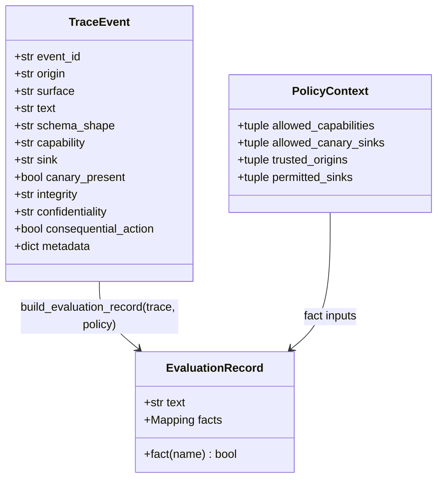
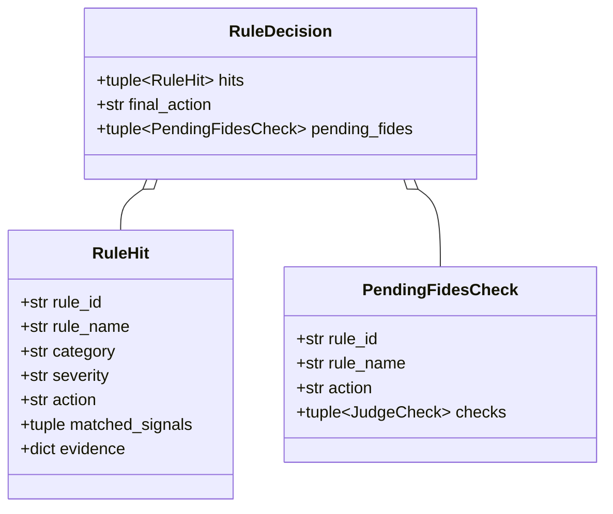
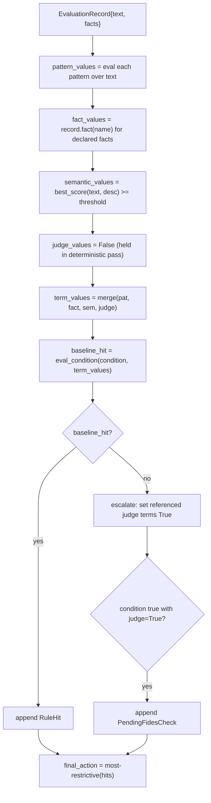
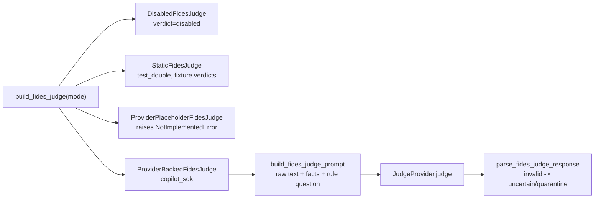
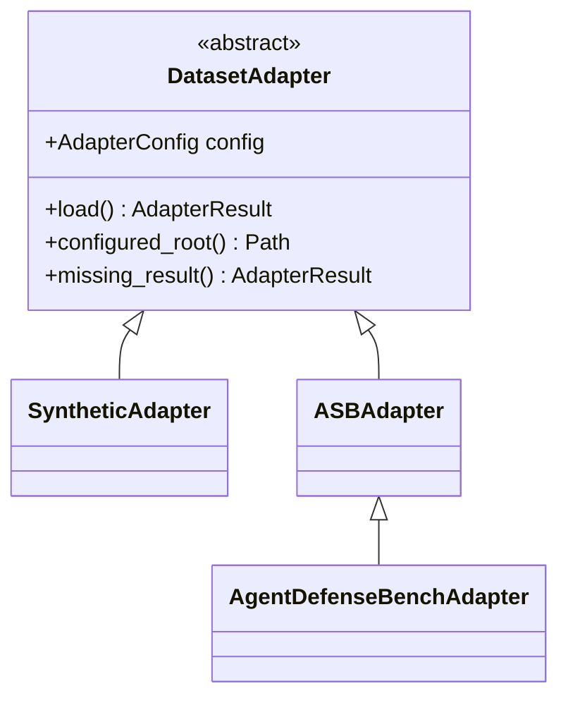

# Low-Level Design (LLD)

> **Scope.** Module-by-module and class-by-class detail for CanaryWeave FIDES.
> Read the [HLD](hld.md) first for the component picture and the two evaluation
> paths. Data movement is in the [DFD](dfd.md). All domain terms follow the
> [`CONTEXT.md`](../../CONTEXT.md) glossary; the [terminology map](#terminology-map)
> at the end reconciles code symbol names with glossary terms.

## 1. Module map

All paths are under `src/canaryweave_fides/`.

| Module | Responsibility |
|---|---|
| `fact_registry.py` | `FROZEN_FACTS`, `FactSpec`, `is_fact`, `fact_spec` — the closed fact vocabulary. |
| `normalization.py` | `hidden_char_count`, `has_hidden_unicode_structure`, `has_untrusted_instruction_shape`, `looks_encoded_or_high_entropy`. |
| `semantics.py` | `best_score` — provider-free fuzzy-intent scoring for `semantics:` layers. |
| `rule_loader.py` | Tokenizer + block parser: `.war` text → structured rule dicts. |
| `rule_schema.py` | `RuleDefinition`, `PatternDef`, `SemanticPattern`, `JudgeCheck`, `TechniqueRef`; validation and condition helpers. |
| `rule_engine.py` | `RuleEngine`, `build_evaluation_record`, `_compute_fact` — the shared decision core. |
| `models.py` | `TraceEvent`, `PolicyContext`, `EvaluationRecord`, `RuleHit`, `PendingFidesCheck`, `RuleDecision`, `FidesVerdict`, `QueryResult`. |
| `query_llm.py` | `QueryRequest`, `DeterministicQuarantinedModelStub`, `query_llm` — Path A gate. |
| `fides.py` | `FidesIFCMode`, `FidesIFCLayer` — deterministic IFC stage. |
| `decisions.py` | `StackName`, `Decision`, `BlockedBy`, `FidesVerdict`, `GateDecision` — Path B result vocabulary. |
| `facts.py` | `NormalizedFacts` — OPA-like gate input derived from an `AttackCase`. |
| `gate.py` | `evaluate_stack`, `evaluate_case`, the `FidesJudge` family, `build_fides_judge`. |
| `fides_prompt.py` | `build_fides_judge_prompt`, `parse_fides_judge_response` — provider I/O contract. |
| `cases.py` | `AttackCase`, `GroundTruth`, `CaseKind`, `ExpectedBehavior`. |
| `cases_dsl.py` | `.cases` parser: `parse_cases`, `case_example_to_attack_case`. |
| `adapters/` | `DatasetAdapter` base + `SyntheticAdapter`, `ASBAdapter`, `AgentDefenseBenchAdapter`, identifiers, registry. |
| `runner.py` | `EvaluationRunConfig`, `run_evaluation` — iterations × stacks × datasets. |
| `metrics.py` | `summarize_smoke` — legacy smoke summary. |
| `reporting.py` | `build_public_report` — the modern public report. |
| `rich_report.py` | Rich console rendering for single-rule `warden check`. |
| `simulators/` | `simulate_case` + API/MCP wrappers; `SimulationResult`. |
| `providers/` | `JudgeProvider` base, `CopilotSdkJudgeProvider`, fake provider. |
| `config.py` | `LoadedEvalConfig`, `load_eval_config` — YAML config loading. |
| `fixtures.py` | `smoke_cases()` legacy fixtures for the smoke path. |
| `resources.py` | `rules_root()` and packaged-asset resolution. |
| `mappings.py` | Shared taxonomy / label mapping helpers. |
| `cli.py` | Argparse command tree (see [§9](#9-cli-surface)). |

## 2. Core data structures

### 2.1 The flat record and its source trace



`EvaluationRecord` (`models.py`) is the single surface a rule and a test case
touch: raw `text` plus the six boolean `facts`. `TraceEvent` is the richer window
the framework projects from — synthetically today, from the MCP wire later. The
projection is `rule_engine.build_evaluation_record`.

### 2.2 Rule decision results



`final_action` is the most-restrictive action across hits: any
`block_and_audit`/`critical` hit → `block`; any `quarantine` → `quarantine`; else
`allow` (`rule_engine.RuleEngine._final_action`).

### 2.3 Path-specific result envelopes

| Result | Module | Produced by | Key fields |
|---|---|---|---|
| `QueryResult` | `models.py` | `query_llm` (Path A) | `allowed`, `model_called`, `blocked_by`, `preflight`, `postflight`, `fides` |
| `GateDecision` | `decisions.py` | `evaluate_stack` (Path B) | `stack`, `decision`, `blocked_by`, `rule_ids`, `fides_verdict`, `reason_codes` |
| `FidesVerdict` (Path A) | `models.py` | `FidesIFCLayer.evaluate` | `verdict`, `confidence`, `blocks`, `policy_checks` |
| `FidesVerdict` (enum) | `decisions.py` | judge results | `safe`/`unsafe`/`uncertain`/`disabled`/`not_called` |
| `FidesJudgeResult` | `gate.py` | `FidesJudge.judge` | `verdict`, `confidence`, `reason_codes`, `recommended_decision`, `provider_calls` |

> Two `FidesVerdict` types exist: a frozen dataclass in `models.py` (Path A, with a
> `blocks` boolean) and a string enum in `decisions.py` (Path B verdict label).
> They are not interchangeable; see the [terminology map](#terminology-map).

### 2.4 Rule definition

`RuleDefinition` (`rule_schema.py`) is the validated, frozen form of one `rule {}`
block:

| Field | Meaning |
|---|---|
| `id`, `name`, `version`, `severity`, `scope`, `action`, `description` | Identity envelope from `meta:`. |
| `technique: tuple[TechniqueRef, ...]` | ATT&CK/ATLAS/D3FEND anchors; `tactic` is derived from the first technique. |
| `tactic: str` | MITRE tactic — the rule's classification axis (replaces the old `category`). |
| `patterns: tuple[PatternDef, ...]` | Deterministic text matchers (exact or regex). |
| `facts: tuple[str, ...]` | Built-in `$fact` names referenced by the condition. |
| `semantics: tuple[SemanticPattern, ...]` | Fuzzy-intent checks with a threshold. |
| `judge_checks: tuple[JudgeCheck, ...]` | Natural-language questions for the FIDES judge. |
| `condition: str` | Boolean expression over declared terms and built-in facts. |
| `layer_names` (property) | Maps layer → declared term names, used for quantifier expansion. |

## 3. Rule engine internals

`RuleEngine.evaluate(trace, policy)` (`rule_engine.py`) is a thin adapter that
projects the trace to an `EvaluationRecord` and delegates to `evaluate_record`.
Per rule, the core does:



Key algorithms:

- **Condition evaluation** (`_eval_condition`). Quantifier sugar (`any of
  patterns`, `all of them`, `any of ($a, $b)`, …) is expanded to `or`/`and`
  chains, each `$term` is substituted with `True`/`False`, and the result is
  checked against a strict whitelist regex (`_SAFE_EXPR_RE`) before `eval` runs
  with empty builtins. Any stray token raises `RuleEngineError` — this is the
  guard that keeps `eval` safe.
- **Judge escalation.** Judge terms are False in the deterministic pass. If a rule
  would fire *only* when its referenced judge terms are True, a
  `PendingFidesCheck` is emitted instead of a hit — that is the seam Path B uses
  to route the rule's question to the FIDES judge on a WARDEN miss.
- **Fact computation** (`_compute_fact`). Each of the six frozen facts is derived
  from `TraceEvent` fields + `PolicyContext`:

| Fact | Derivation |
|---|---|
| `from_untrusted_origin` | any event `origin` ∈ `{resource_content, tool_output, server_manifest, server_sampling}` |
| `capability_denied` | any event `capability` not in `policy.allowed_capabilities` |
| `canary_outside_sink` | any event `canary_present` and `sink` ∉ `policy.allowed_canary_sinks` |
| `tool_call_shape` | any event `schema_shape` ∈ `{tool_plan_like_json, tool_plan, tool_plan_like, tool_call}` |
| `hidden_unicode` | `has_hidden_unicode_structure(text)` — zero-width/format chars or NFKC change |
| `instruction_shape` | `has_untrusted_instruction_shape(text)` — system/role + directive regex |

## 4. Normalization

Pure text-feature functions in `normalization.py`, all deterministic and
provider-free:

- `hidden_char_count` — counts `Cf`/`Cc` category chars excluding ordinary ASCII
  whitespace (`\t\n\r\v\f`).
- `has_hidden_unicode_structure` — true if hidden chars exist or NFKC
  normalization changes the string.
- `looks_encoded_or_high_entropy` — base64-ish ratio > 0.92 over ≥40 compact
  chars, with at least one digit.
- `has_untrusted_instruction_shape` — regex over `system|developer|policy|…`
  followed within 80 chars by `rule|message|instruction|override|…`.

## 5. The fact-to-trace projection

Path B starts from `NormalizedFacts` (dataset-derived), but the rule engine needs
a `TraceEvent` + `PolicyContext`. `gate.py:_facts_to_trace_and_policy` bridges
them:

- `schema_shape` is normalized to `tool_plan_like_json` when the case is
  tool-plan-shaped.
- `origin` is the first origin label (or `unknown`); `integrity` is `low` when
  trust labels include `untrusted`.
- `consequential_action` is set when the case is tool-plan-shaped, requests an
  action, or requests a capability.
- `PolicyContext` is filled from the case's `policy` allowlists.

This is why the same six facts compute consistently across both paths.

## 6. FIDES implementations

### 6.1 Deterministic IFC

`fides.py:FidesIFCLayer` runs two checks per trace event, producing a Path A
`FidesVerdict`:

- **trusted_action** — a `consequential_action` from low-integrity or untrusted
  origin → unsafe.
- **permitted_flow** — `confidentiality == "restricted"` flowing to a `sink` not
  in `policy.permitted_sinks` → unsafe.

Disabled mode returns `verdict="disabled", blocks=False`.

### 6.2 LLM judge modes

`build_fides_judge(mode)` (`gate.py`) selects one of four judge implementations:



`FidesJudgeResult.__post_init__` enforces invariants: confidence ∈ [0, 1],
non-negative `provider_calls`, and a recommended decision derived from the verdict
when not supplied. The test double never records provider calls or transcripts.

## 7. Cases DSL

`cases_dsl.py` parses the `.cases` grammar (see
[`data/cases/smoke.cases`](../../data/cases/smoke.cases)):

```text
cases <attack_type> [$fact, $fact] {      # header facts: structural facts only
    "raw detail string" -> block|allow    # one case per line
}
```

- Header facts must be `$`-prefixed structural facts; unknown or text-derived
  facts are a parse error.
- `case_example_to_attack_case` maps each line to an `AttackCase`: structural
  facts → `safe_features`/`policy_context`, raw detail → `private_data.raw_input`,
  `block` → `(attack, ExpectedBehavior.BLOCK)`, `allow` → `(benign, ALLOW)`.
- Text-derived facts (`tool_call_shape`, `hidden_unicode`, `instruction_shape`)
  are computed from the detail at evaluation time, not declared in the header.

## 8. Adapters

The `adapters/` package provides a `DatasetAdapter` base and three adapters:



- `AdapterResult.status` ∈ `loaded | empty | skipped_disabled |
  skipped_missing_local_path`.
- `SyntheticAdapter` emits five hand-authored, always-available `AttackCase`s.
- `ASBAdapter` crawls local files (`.jsonl/.json/.yaml/.yml/.csv/.txt`), hashes
  raw material, and keeps raw payloads in `private_data` (excluded from
  `to_dict`). Root: `CANARYWEAVE_ASB_ROOT`.
- `AgentDefenseBenchAdapter` is a thin ASB subclass; root:
  `CANARYWEAVE_AGENTDEFENSEBENCH_ROOT`. Absent dataset →
  `skipped_missing_local_path`.
- Identifiers are opaque, HMAC-derived; override key via
  `CANARYWEAVE_PUBLIC_HMAC_KEY`.

## 9. CLI surface

Entry point: `python -m canaryweave_fides.cli` (`cli.py`). Subcommand tree:

| Command | Purpose | Output |
|---|---|---|
| *(default)* / `smoke` | Legacy smoke run (`FidesIFCLayer`). | `artifacts/smoke_report.json` + console JSON |
| `warden check` | Scan one prompt through `yara_rules`. | `warden_check.v1` JSON or Rich panel |
| `warden test` | Run a `.cases` corpus across all four stacks. | table / JSON / JSONL / CSV; exit 0/1/2 |
| `judge one` | WARDEN + optional FIDES on one prompt. | `judge_one.v1` JSON |
| `bench scan` | Scan prompts from JSONL/CSV/TXT. | `bench_scan.v1` JSON |
| `eval` | Full dataset run via `run_evaluation`. | `artifacts/evals/gate_eval_report.json` |
| `provider status/models/doctor` | Inspect the optional Copilot SDK provider. | JSON |

Live provider calls require `--fides-mode copilot_sdk` **and**
`--provider-calls-enabled` **and** `--model`. Defaults keep every command
provider-free.

## 10. Reporting

| Function | Path | Schema | Stack names |
|---|---|---|---|
| `metrics.summarize_smoke` | legacy `smoke` | `schema_version` smoke fields | `no_guard`, `regex_guard`, `structured_rule_guard`, `rules_plus_fides_ifc` |
| `reporting.build_public_report` | modern `eval` | `canaryweave_fides.public_report.v1` | canonical `StackName` |

The public report carries `security_metrics`, `incremental_metrics`,
`disagreement_matrix`, `maintainability_metrics`, and `safety` blocks. The
divergent stack vocabulary between the two is a [known gap](hld.md#8-known-post-refactor-gaps).

## Terminology map

Reconciles code symbols with the [`CONTEXT.md`](../../CONTEXT.md) glossary. The
glossary is canonical for prose; the code names are what you grep for.

| Code symbol | Glossary term | Note |
|---|---|---|
| `TraceEvent` (`models.py`) | **NormalizedTrace** | Framework-internal window that populates the record. Glossary avoids "TraceEvent". |
| `EvaluationRecord` (`models.py`) | **Evaluation record** | The flat `{text, facts}` rules evaluate. |
| `NormalizedFacts` (`facts.py`) | (Path B gate input) | OPA-like input derived from `AttackCase`; distinct from the `{text, facts}` record. |
| `FidesIFCLayer` (`fides.py`) | **FIDES/IFC** part (1) | The always-on deterministic structural check. |
| `FidesJudge` (`gate.py`) | **FIDES/IFC** part (2) | The LLM judge boundary. |
| `RuleHit.category` | **tactic** | Holds `rule.tactic`; the field name predates the rename. |
| `StackName` | **Guard stack** | Canonical stack vocabulary. |

## Related documents

- [High-Level Design](hld.md) · [Data Flow Diagrams](dfd.md)
- [`design/rule_schema.md`](../../design/rule_schema.md) — authoritative `.war` schema.
- [`docs/rule_authoring.md`](../rule_authoring.md) — author-facing guidance.
- [ADR 0003](../adr/0003-collapse-to-facts-and-cases.md) — the refactor.
